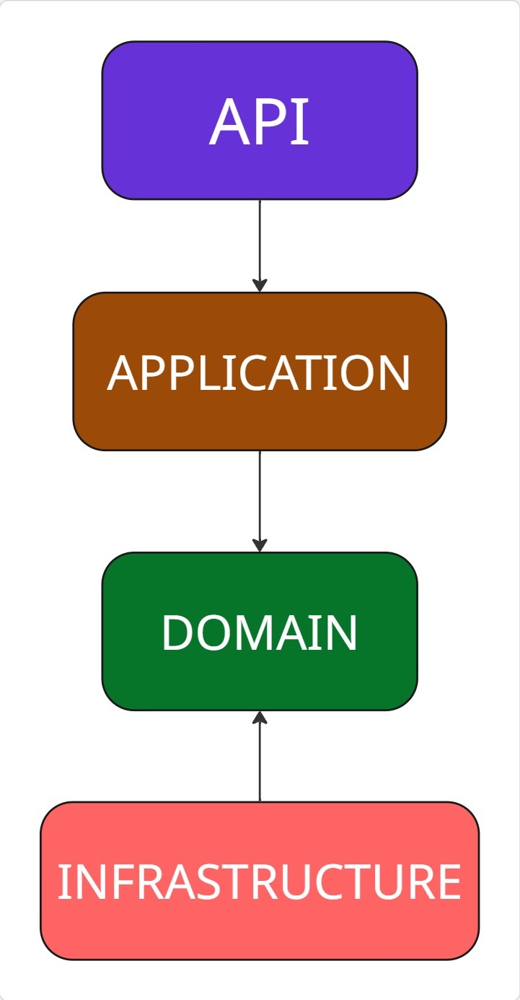

# 📌 Tecnologias Utilizadas — AnimieTechTV

O projeto **AnimieTechTV** foi desenvolvido com um conjunto de tecnologias modernas que facilitam a criação, manutenção e escalabilidade da aplicação.  
Abaixo estão as principais ferramentas utilizadas, separadas por área e função:

---

### 🔹 Backend
- **.NET 8** → Framework principal para desenvolvimento da API
- **SQL Server 2022** → Banco de dados usado no projeto
- **Entity Framework Core** → ORM para mapeamento objeto-relacional  
- **Dapper** → Micro ORM para consultas SQL de alta performance  
- **FluentValidation** → Validações de regras de negócio  
- **MediatR** → Implementação do padrão CQRS e desacoplamento de handlers  
- **FluentMigrator** → Controle e versionamento do banco de dados  

### 🔹 Testes e Mock
- **Bogus** → Geração de dados fake para testes  
- **Moq** → Criação de mocks para testes unitários  
---

## Arquitetura

A aplicação está organizada em 4 camadas:

1. **API**  
   - Ponto de entrada da aplicação.  
   - Contém Controllers e filtros globais.  
   - Depende apenas da **Application**.
   - OBS: Para realizar a depdency injection, essa camda acaba tendo dependencia com a **Infrastructure**  

2. **Application**  
   - Contém lógica de casos de uso (Handlers do MediatR).   
   - Depende apenas da **Domain Layer**.

3. **Domain**  
   - Contém entidades, agregados alem da interface para os repository.  
   - Não depende de nenhuma outra camada.

4. **Infra**  
   - Implementações de repositórios, cache (Redis), banco de dados (Dapper/EF), e migrations.  
   - Depende apenas de **Domain** e bibliotecas externas.

**Diagrama simplificado:**


## 🐳 Rodando o AnimieTechTV Localmente com Docker

Este guia mostra como executar a aplicação **AnimieTechTV** em um ambiente local utilizando **Docker**.

### 📋 Pré-requisitos

Antes de começar, verifique se você tem instalado:

- [Docker](https://docs.docker.com/get-docker/)  
- [Docker Compose](https://docs.docker.com/compose/install/)  
- [Git](https://git-scm.com/)  

---

### 🚀 Passo a Passo

#### 1️⃣ Clone o repositório
```bash
git clone https://github.com/amadeu100401/AnimieTechTV.git
cd AnimieTechTV
```
#### 1️⃣ Suba os containers
```bash
docker-compose up --build
```
Este projeto utiliza **Docker Compose** para orquestrar os serviços da aplicação **AnimeTechTV** e seu banco de dados SQL Server.

1. **AnimeTechTV (Backend)**  
   - Aplicação backend principal do projeto.  
   - Responsável por gerenciar a lógica do sistema, APIs e comunicação com o banco de dados.

2. **SQL Server**  
   - Banco de dados relacional utilizado para armazenar os dados da aplicação.  
   - Configurado para se conectar automaticamente com o backend.

## Endpoints

| Método | Endpoint              | Descrição                          | Sucesso | Erros Possíveis |
|--------|----------------------|------------------------------------|----------|-----------------|
| POST   | /api/v1/animie          | Cria um novo anime                 | 201 Created (retorna objeto criado) | 400 Bad Request (validação) |
| GET    | /api/v1/animie          | Retorna lista de animes com paginação (`page`, `pageSize`) | 200 OK | - |
| GET    | /api/v1/animie/filter   | Busca animes por `id`, `name` ou `director` | 200 OK (lista filtrada) | 404 Not Found |
| PUT    | /api/v1/animie/{id}     | Atualiza informações de um anime   | 200 OK (objeto atualizado) | 400 Bad Request |
| DELETE | /api/v1/animie/{id}     | Remove um anime por ID             | 200 OK | 400 Bad Request (ID inválido) |

---

## 🔹 Criar um anime
**POST /api/v1/animie**

Cria um novo anime.

### Request
```bash
curl -X POST http://localhost:8080/api/v1/animie \
  -H "Content-Type: application/json" \
  -d '{
    "name": "Naruto",
    "director": "Hayato Date",
    "resume": 220,
  }'
```
### Response 
```bash
{
  "id": "11111111-1111-1111-1111-111111111111",
  "name": "Naruto",
  "director": "Hayato Date",
  "resume": ""
}
```
---
## 🔹 Listar animes (com paginação)
GET /api/v1/animie?page=1&pageSize=10

Retorna todos os animes com suporte a paginação.

### Request
```bash
curl -X GET "http://localhost:8080/api/v1/animie?page=1&pageSize=5"
```
### Response 
```bash
{
  "pagination" : {
    "TotalItem": 10,
    "PageSize": 10,
    "PageNumber": 1
  },
  "Items": [
    {
      "AnimieIdentification": 11111111-1111-1111-1111-111111111111,
      "Name": "One Piece",
      "Director": "Konosuke Uda",
      "Resume": "" 
    }
  ]
}
```
---
## 🔹 Buscar animes por filtro
GET /api/v1/animie/filter

Permite filtrar por id, name ou director.

### Request
```bash
# Por nome
curl -X GET "http://localhost:8080/api/v1/animie/filter?name=Naruto"

# Por diretor
curl -X GET "http://localhost:8080/api/v1/animie/filter?director=Hayato%20Date"

# Por ID
curl -X GET "http://localhost:8080/api/v1/animie/filter?id=11111111-1111-1111-1111-111111111111"

# Usando todos os parametros
curl -X GET "http://localhost:8080/api/v1/animie/filter?id=11111111-1111-1111-1111-111111111111&name=Naruto&director=Hayato%20Date"
```
### Response 
```bash
[
  {
      "AnimieIdentification": 11111111-1111-1111-1111-111111111111,
      "Name": "One Piece",
      "Director": "Konosuke Uda",
      "Resume": "" 
  }
]
```
---
## 🔹 Atualizar um anime
PUT /api/v1/animie/{id}

Atualiza as informações de um anime existente.

### Request
```bash
curl -X PUT http://localhost:8080/api/v1/animie/11111111-1111-1111-1111-111111111111 \
  -H "Content-Type: application/json" \
  -d '{
    "name": "Naruto",
    "director": "Hayato Date",
    "resume": ""
  }'
```
### Response 
```bash
{
  "id": "11111111-1111-1111-1111-111111111111",
  "name": "Naruto",
  "director": "Hayato Date",
  "resume": ""
}
```
---
### 🔹 Deletar um anime
DELETE /api/v1/animie/{id}

Remove um anime pelo ID.

### Request
```bash
curl -X DELETE http://localhost:8080/api/v1/animie/11111111-1111-1111-1111-111111111111
```

## ⚠️ Observações
- A API roda por padrão em **http://localhost:8080** (conforme configuração no `Program.cs`).   
- Todos os **Commands** possuem validações via **FluentValidation**.  
- Logs são gerados automaticamente em **/logs/log-YYYY-MM-DD.txt** (um arquivo por dia, mantidos por 30 dias).
- Para habilitar a documentação via Swagger, basta trocar a variavel no docker-compose de *Production* para *Development*
- A documentação interativa da API pode ser acessada via **Swagger UI** em:  
  **http://localhost:8080/index.html**  

